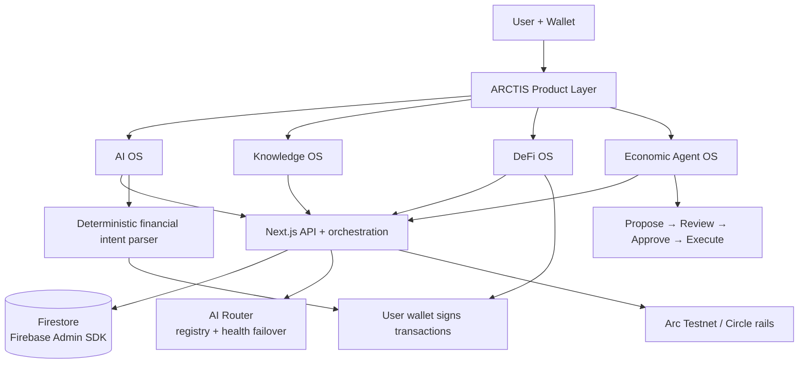

<div align="center">
  
  <h1>ARCTIS</h1>
  <p><strong>An AI operating environment for people, knowledge, agents and programmable money.</strong></p>
  <p>Built on Arc Testnet · wallet-controlled · testnet stage</p>

  <p>
    
    
    
    
  </p>
</div>

---

## The idea

ARCTIS brings four connected capabilities into one product surface:

- **AI OS** — 12 task-oriented personas with automatic backend model routing.
- **Knowledge OS** — workspaces, saved prompts, sessions, agents and report context.
- **DeFi OS** — user-controlled transfers, an ARCTIS OTC swap layer, and cross-chain USDC bridging.
- **Economic Agent OS** — budgeted agents with proposals, human approval, execution history and independent evaluation.

The product deliberately hides provider/model complexity from the user. The user interacts with **ARCTIS AI**, not a model marketplace.

> **ARCTIS is built on Arc. Arc is infrastructure; ARCTIS is the product.**

## See the architecture

<p align="center">
  
</p>

For the detailed implementation model, see [`SYSTEM_ARCHITECTURE.md`](./SYSTEM_ARCHITECTURE.md) and the canonical product facts in [`ARCHITECTURE_TRUTH.md`](./ARCHITECTURE_TRUTH.md).

### Architecture at a glance



## What is actually implemented

### AI

- 12 personas: Study, Build, Analyze, Research, Generate, Treasury, Developer, Student, Teacher, Professor, Child and Engineering.
- Automatic free-model discovery and health-ranked failover through the server-side AI router.
- Streaming and non-streaming responses.
- Session persistence and saved prompts through server API routes.
- Copilot context assembled from bounded, user-owned application data.
- Voice input and markdown-capable AI surfaces.
- Natural-language Transfer / Swap / Bridge intent can produce a **proposal**, but never signs or submits a transaction.

### Money and onchain operations

- **Transfer:** user wallet signs the transaction.
- **Swap:** configured ARCTIS OTC settlement for the registered test assets; it is not an AMM.
- **Bridge:** Circle App Kit integration with configured CCTP routes, source-chain preflight checks and bridge history.
- **Proof-oriented records:** onchain transaction state is accompanied by explorer/activity/ledger/accounting records where the operation requires them.
- **Treasury:** observer/accounting layer; it does not control the user's transaction flow.

### Agents

The agent safety boundary is explicit:

`Propose → Review → Approve → Execute`

Agents have budgets, execution history, reports and evaluator support. They do **not** receive a hidden private key and do not silently sign the user's wallet transactions.

### Identity and platform

- Wallet-based Passport profiles and public username resolution.
- Membership entitlements and credit balances.
- Global command palette (`⌘K` / `Ctrl+K`).
- Light/dark theme system.
- First-run product orientation.
- Responsive UI and accessibility improvements.
- One-button locale selection with 10 languages: English, Hindi, Spanish, Portuguese, Chinese, Korean, Vietnamese, French, Swahili and Arabic, including RTL handling for Arabic.

## Current network and assets

**Current product stage: Arc Testnet.**

| Asset / rail | Current role |
|---|---|
| Arc Native USDC | Primary payment and gas asset |
| tUSDC | ARCTIS OTC test asset |
| tARC | ARCTIS OTC test asset; not an official Arc native token |
| CCTP routes | Configured testnet bridge routes through Circle tooling |

Executable asset truth lives in [`src/config/assets.ts`](./src/config/assets.ts); network and contract truth lives in [`src/lib/contracts.ts`](./src/lib/contracts.ts).

## What ARCTIS does **not** claim yet

This repository is intentionally honest about its stage.

- It is **not a mainnet product**.
- It is **not presented as security audited**.
- Knowledge OS is not yet a full PDF/OCR/vector-RAG platform.
- ARCTIS does not claim persistent cross-session personal memory beyond the implemented session/context systems.
- Agent execution is not autonomous wallet spending.
- tARC is not an official Arc token.
- Bridge availability is limited to the routes actually configured in the repository.
- Some production hardening and live end-to-end testnet verification remain deployment tasks.

The current limitations and implementation boundary are maintained in [`ARCHITECTURE_TRUTH.md`](./ARCHITECTURE_TRUTH.md).

## Tech stack

| Layer | Implementation |
|---|---|
| Web | Next.js 14 App Router + React 18 |
| Language | TypeScript, strict mode |
| UI | Tailwind CSS + Framer Motion + Lucide |
| State | Zustand |
| Wallet | Wagmi + Viem + RainbowKit |
| Bridge | Circle App Kit + Viem adapter |
| Database | Firebase Firestore via Firebase Admin SDK |
| AI | Server-side OpenRouter adapter with automatic routing |
| Charts | Recharts |
| Email | Resend |
| Network | Arc Testnet |

## Repository structure

```text
src/
├── app/                  # product pages and Next.js API routes
│   ├── dashboard/        # overview
│   ├── ai/               # AI Workspace
│   ├── copilot/          # contextual Copilot
│   ├── agents/           # Economic Agent OS
│   ├── workspace/        # Knowledge OS workspace
│   ├── knowledge/        # Knowledge OS surface
│   ├── transfer/         # user-controlled transfer
│   ├── swap/             # ARCTIS OTC swap
│   ├── bridge/           # Circle App Kit bridge flow
│   ├── passport/         # wallet identity
│   ├── history/          # canonical user history
│   ├── treasury/         # observer/accounting surface
│   ├── membership/       # membership entitlements
│   ├── credits/          # credit balances and purchases
│   └── api/              # server-side orchestration and persistence
├── config/               # canonical AI, asset and billing configuration
├── components/           # reusable UI and agent components
├── lib/                  # domain services, routing, chain and Firebase logic
└── types/                # shared TypeScript models

docs/
└── architecture-flow.svg # animated architecture overview
```

## Quick start

### Requirements

- Node.js 22 recommended (Codespaces configuration uses Node 22).
- npm.
- Firebase project with Firestore enabled.
- WalletConnect project ID.
- OpenRouter API key for AI routes.
- A testnet wallet for Arc and any configured bridge source chain.

### Run locally

```bash
npm install
cp .env.example .env.local
# fill the required values in .env.local
npm run dev
```

Open `http://localhost:3000`.

### Verify before shipping

```bash
npm run type-check
npm run architecture-truth
npm run build
```

Do not interpret a successful static check as a substitute for live testnet verification.

## Documentation map

| File | Use it for |
|---|---|
| [`ARCHITECTURE_TRUTH.md`](./ARCHITECTURE_TRUTH.md) | Canonical product and capability truth |
| [`SYSTEM_ARCHITECTURE.md`](./SYSTEM_ARCHITECTURE.md) | Detailed runtime architecture and security boundaries |
| [`API_REFERENCE.md`](./API_REFERENCE.md) | API route inventory and contracts |
| [`DATABASE.md`](./DATABASE.md) | Firestore collections and indexes |
| [`DEPLOYMENT.md`](./DEPLOYMENT.md) | Local/testnet deployment setup |
| [`SECURITY.md`](./SECURITY.md) | Security posture and reporting guidance |
| [`ARC_BRAND_GUIDELINES.md`](./ARC_BRAND_GUIDELINES.md) | Approved Arc relationship and naming language |
| [`CHANGELOG.md`](./CHANGELOG.md) | User-facing implementation changes |
| [`DOCUMENTATION_STATUS.md`](./DOCUMENTATION_STATUS.md) | Documentation authority and maintenance rules |

Historical submission/build material is intentionally kept out of the root documentation path. Git history remains the record of earlier iterations.

## Development principles

1. **One source of truth.** Product facts belong in configuration or canonical architecture docs, not scattered literals.
2. **User controls money.** Server code may coordinate and verify; the user's wallet signs the transaction.
3. **Deterministic where money is involved.** Financial intent parsing is deliberately constrained rather than delegated to an LLM.
4. **Fail visibly.** Testnet limitations and operational dependencies should be surfaced, not hidden behind optimistic UI.
5. **Prefer composition over duplication.** Shared activity/history, centralized contracts, centralized billing and shared domain services reduce drift.
6. **Document the current system.** Historical plans do not override runtime behavior.

## Status

ARCTIS is an **active Arc Testnet project** under development. The codebase has moved substantially from its early prototype over the last several months; this README describes the current direction rather than a historical milestone.

If you are evaluating the project, start with the live application, then read the architecture truth and security notes before treating any feature as production-ready.

## Arc relationship

ARCTIS uses Arc as infrastructure and is built for Arc Testnet. This repository does not imply a partnership, endorsement or ownership relationship beyond the integration described in the code.

Official Arc brand guidance: https://community.arc.io/public/blogs/arc-brand-guidelines-and-partner-toolkit-is-live-2026-07-16

## License

No license file is currently included in this repository. Do not assume permission to reuse the code until a license is explicitly added.
