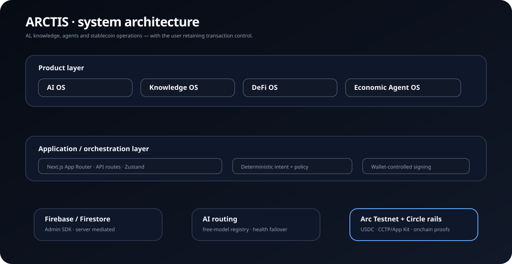
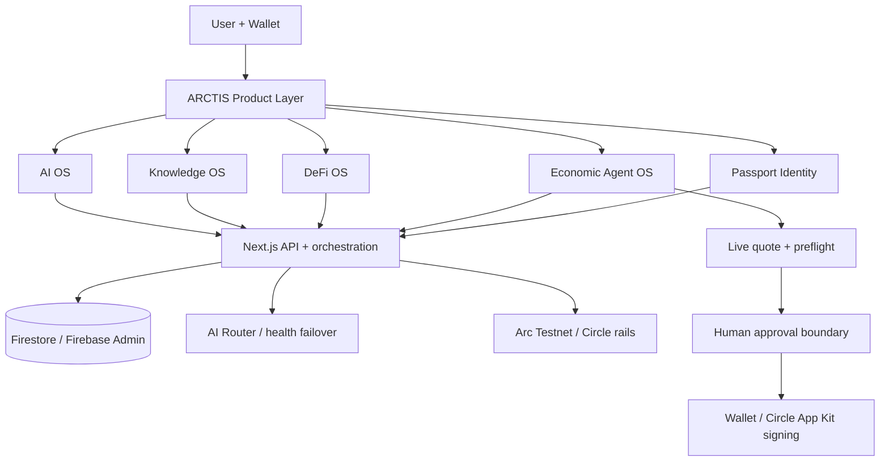

<div align="center">
  
  <h1>ARCTIS</h1>
  <p><strong>Programmable money for humans and AI agents.</strong></p>
  <p>AI · Knowledge · Stablecoins · Economic Agents · Identity</p>
  <p><strong>Built on Arc Testnet</strong> · wallet-controlled · live public testnet build</p>

  <p>
    
    
    
    
  </p>
</div>

---

## What is ARCTIS?

ARCTIS is an **AI operating environment for programmable money** built on Arc Testnet. It brings AI assistance, bounded knowledge context, stablecoin operations, human-readable identity and Economic Agents into one product surface.

The central idea is not an AI chatbot with a wallet. It is a controlled execution pipeline:

```text
Natural-language intent
        ↓
Deterministic interpretation / policy
        ↓
Proposal
        ↓
Live quote + preflight
        ↓
Human review
        ↓
Wallet approval
        ↓
Onchain execution
        ↓
History / proof / accounting
```

> **ARCTIS is the application layer. Arc is the settlement infrastructure.**

## Live product

- **Demo:** https://arctis-zeta.vercel.app
- **Repository:** https://github.com/pawansatoshi/Arctis
- **Network:** Arc Testnet (`5042002`)
- **Primary payment/gas asset:** Arc Native USDC

For an external reviewer, start with [`docs/README-EVALUATION.md`](./docs/README-EVALUATION.md). It contains a five-minute walkthrough and the intended evaluation path.

---

## Product architecture

ARCTIS is organized into four connected operating-system pillars:

### AI OS

AI Workspace, Copilot and task-oriented personas. The backend model/provider is an implementation detail: ARCTIS routes requests through a server-side registry with health/latency-aware failover.

### Knowledge OS

Workspaces, sessions, saved prompts, user-owned agents and bounded report context. The current implementation is application-context based; it is **not** marketed as a full PDF/OCR/vector-RAG platform.

### DeFi OS

User-controlled Transfer, ARCTIS OTC Swap and Circle App Kit/CCTP Bridge flows. Quote, route, fee, balance and gas states are surfaced before execution.

### Economic Agent OS

Agents can interpret a financial task, create a proposal, obtain a live quote, wait for human approval, execute through the existing wallet flow and persist execution/report data.

The mandatory boundary is:

`Propose → Review → Approve → Execute`

Agents do not receive a hidden user private key and do not silently sign user-wallet transactions.

---

## Architecture diagram

<p align="center">
  
</p>

The diagram is intentionally self-contained SVG/CSS. Animated dashed paths communicate control/data flow between product pillars and the orchestration layer; pulsing nodes represent active hand-off points. It requires no external animation service and remains understandable as a static repository image.

The detailed explanation is in [`docs/README-EVALUATION.md`](./docs/README-EVALUATION.md), while the authoritative runtime model is [`SYSTEM_ARCHITECTURE.md`](./SYSTEM_ARCHITECTURE.md).

### Architecture at a glance



---

## What is implemented today

### AI and Copilot

- 12 task-oriented personas: Study, Build, Analyze, Research, Generate, Treasury, Developer, Student, Teacher, Professor, Child and Engineering.
- Automatic backend model discovery and health-ranked failover.
- Streaming and non-streaming responses.
- Persisted AI sessions and saved prompts.
- Bounded Copilot context from implemented user-owned application data.
- Voice input and markdown-capable AI surfaces.
- Deterministic financial intent parsing for Transfer, Swap and Bridge proposals.

### Money operations

**Transfer**

- User wallet remains the signing authority.
- Passport usernames can be resolved to wallet addresses.
- Preflight checks prevent obvious insufficient-balance/gas failures.

**Swap**

- ARCTIS OTC settlement for `USDC`, `tUSDC` and `tARC`.
- Circle Swap surface includes `EURC` as the **last asset in the ARCTIS dropdown**.
- Circle pairs are quoted before approval; if the live route is unavailable, no wallet transaction is started.
- Quote cards explicitly show **You pay**, fees where applicable and **Estimated receive**.
- Agent Swap follows the same quote-before-approval boundary as manual Swap.
- `cirBTC` is intentionally not exposed in the ARCTIS Swap UI at this stage.

**Bridge**

- Circle App Kit + Viem adapter.
- Configured Arc Testnet, Ethereum Sepolia, Base Sepolia and Arbitrum Sepolia metadata, subject to current bridge policy/routes.
- Source-chain balance and native-gas preflight.
- Live quote before approval.
- Fee breakdown: provider, forwarding and gas where returned.
- Explicit **Estimated receive** amount.
- Agent Bridge follows quote → review → wallet approval rather than auto-approving after proposal creation.

### Economic Agents

The current agent state machine is deliberately explicit:

```text
Agent intent
   ↓
Proposal
   ↓
Recipient / route validation
   ↓
Live quote
   ↓
Expected receive shown
   ↓
Human review
   ↓
Wallet approval
   ↓
Execution
   ↓
History / report / ledger
```

Economic Agent recipient entry uses the same canonical Passport validation path as Manual Transfer, so `.arc` recipients are verified while typing rather than only at execution time.

### Passport identity

- Wallet-linked Passport profiles.
- Public `.arc` username resolution.
- Owner edit flow.
- Profile photo can be added during Passport creation or later from the existing Passport.
- Photo can be changed/removed without recreating the Passport.
- Passport owner view includes a direct return path to ARCTIS Home.

### Platform

- Dashboard, History, AI OS, DeFi OS, Knowledge OS, Finance and Platform navigation.
- Membership and Credits with persisted entitlement/ledger concepts.
- Treasury observer/accounting surface.
- Command palette.
- First-run product orientation.
- Responsive/mobile UX and accessibility improvements.
- 10-language locale selector with Arabic RTL handling.

---

## Current network and assets

**Stage: Arc Testnet.**

| Asset / rail | Role | Current status |
|---|---|---|
| Arc Native USDC | Primary payment + gas asset | Active |
| tUSDC | ARCTIS OTC test asset | Active |
| tARC | ARCTIS OTC test asset; not an official Arc token | Active |
| EURC | Circle Swap integration surface | Quote/route availability depends on current Circle/Arc Testnet conditions |
| cirBTC | Circle-supported Arc Testnet asset, intentionally not exposed by ARCTIS UI | Not in ARCTIS Swap surface |
| CCTP | Cross-chain USDC bridge rail | Configured testnet routes |

Executable asset truth is derived from `src/config/assets.ts` and the Swap-specific Circle registry in `src/lib/swap/circle.ts`. Network/contract truth lives in `src/lib/contracts.ts`.

---

## Testnet contract references

The current Arc Testnet configuration includes:

- **Arc Native USDC:** `0x3600000000000000000000000000000000000000`
- **tUSDC:** `0x28E49B36C1c6fD16ad81aB152488f37C93b3D8CA`
- **tARC:** `0xe66a11cb4b147F208e6d81B7540bfc83E1680c78`
- **ARCTIS Memo contract:** `0x5294E9927c3306DcBaDb03fe70b92e01cCede505`

These are testnet/application addresses. They must not be interpreted as mainnet deployments or official Arc-issued tokens.

---

## Data and persistence

Firestore is accessed through the Firebase Admin SDK from server-side routes. Important domain collections include:

```text
transactions
activity
bridge_pending
swap_records
passports
agents
agent_executions
agent_reports
agent_ledger
credit_balances
credit_ledger
memberships
ai_sessions
saved_prompts
obs_logs
rate_limits
```

`History` is the canonical user-facing historical surface; `/api/activity` is the aggregation layer behind relevant activity data.

---

## Security model

The intended money boundary is:

```text
User intent
   ↓
Validation / policy
   ↓
Server coordination + verification
   ↓
User wallet / Circle App Kit signing
   ↓
Onchain settlement
   ↓
Persistence / explorer / history
```

Financial intent parsing is deliberately deterministic. The LLM can help understand intent, but it is not trusted to invent a transaction amount, token pair, destination or signing operation.

Agent proposals do not equal authorization. Wallet approval remains the final user-controlled boundary.

---

## Current limitations — intentionally disclosed

ARCTIS is a **testnet-stage build**.

- It is not independently security audited.
- It is not presented as mainnet-ready.
- Some mutating routes still need stronger cryptographic wallet-proof enforcement before mainnet.
- AI health/model-registry state is currently process-local.
- Knowledge OS is not yet full document ingestion/vector RAG.
- Bridge and Circle Swap route availability depends on current testnet infrastructure/liquidity/policy.
- tARC is an ARCTIS test asset, not an official Arc token.
- Mainnet contract placeholders are not production configuration.

These limitations are documented deliberately so external reviewers can distinguish **implemented capability, configured capability and future hardening**.

---

## Tech stack

| Layer | Implementation |
|---|---|
| Web | Next.js 14 App Router + React 18 |
| Language | TypeScript strict |
| UI | Tailwind CSS + Framer Motion + Lucide |
| State | Zustand |
| Wallet | Wagmi + Viem + RainbowKit |
| Circle | Circle App Kit + Viem adapter; CCTP bridge integration |
| Database | Firebase Firestore + Firebase Admin SDK |
| AI | Server-side OpenRouter adapter + automatic routing |
| Charts | Recharts |
| Email | Resend |
| Network | Arc Testnet |

---

## Repository map

```text
src/app/                 product pages + API routes
src/components/          reusable UI + agent components
src/config/              AI, assets, billing configuration
src/lib/                 domain services, auth, chain, bridge, swap, AI
src/types/               shared TypeScript models

docs/architecture-flow.svg     animated architecture overview
docs/README-EVALUATION.md      external reviewer / judge walkthrough

ARCHITECTURE_TRUTH.md           canonical capability truth
SYSTEM_ARCHITECTURE.md          runtime architecture + security boundaries
API_REFERENCE.md                API inventory
DATABASE.md                     Firestore/data model
DEPLOYMENT.md                   setup + deployment
aSECURITY.md                    security posture
CHANGELOG.md                    material product changes
```

---

## Local development

Requirements:

- Node.js 22 recommended.
- npm.
- Firebase project with Firestore enabled.
- WalletConnect project ID.
- OpenRouter API key for AI routes.
- Arc Testnet wallet and required testnet assets/gas.

```bash
npm install
cp .env.example .env.local
npm run type-check
npm run architecture-truth
npm run build
npm run dev
```

Open `http://localhost:3000`.

A successful static build is not a substitute for live Arc Testnet verification.

---

## Documentation authority

- [`ARCHITECTURE_TRUTH.md`](./ARCHITECTURE_TRUTH.md) — canonical product/capability truth.
- [`SYSTEM_ARCHITECTURE.md`](./SYSTEM_ARCHITECTURE.md) — runtime architecture and security boundaries.
- [`API_REFERENCE.md`](./API_REFERENCE.md) — route inventory.
- [`DATABASE.md`](./DATABASE.md) — persistence model.
- [`DEPLOYMENT.md`](./DEPLOYMENT.md) — deployment setup.
- [`SECURITY.md`](./SECURITY.md) — security posture.
- [`CHANGELOG.md`](./CHANGELOG.md) — meaningful recent changes.
- [`docs/README-EVALUATION.md`](./docs/README-EVALUATION.md) — external evaluator walkthrough.

Code/configuration is authoritative when documentation and runtime behavior disagree.

## Arc relationship

ARCTIS is built on Arc Testnet and uses configured Circle/Arc tooling. This repository does **not** imply an official Circle partnership, endorsement or ownership relationship unless separately confirmed by Circle.

## License

No license file is currently included. Do not assume permission to reuse the code until a license is explicitly added.
